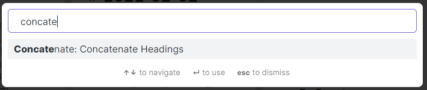

## Obsidian Concatenate Plugin

### Manual Installation

- Download the latest `main.js & mainfest.json` from [releases](https://github.com/eleanorkonik/concatenate/releases). 
- Create a new folder named 'obsidian-concatenate'
- Place the three files in the folder (although honestly styles.css doesn’t matter)
- Place the folder in your .obsidian/plugins directory
- Reload plugins
- Activate the "Concatenate" plugin

### How to use the plugin

1. Navigate to plugin settings. 
2. Assign a value for which header you want to concatenate the contents of. (i.e. `## Reflections` or `### Meeting Logs`) 
3. Assign a folder you want to limit the concatenation to (i.e. `Calendar/2021/January`) 
4. Use the command palette (`ctrl+p` on windows by default) to `Concatenate Headings`. 
5. View, rename, and/or move the outputted file, which will be created in your vault’s root directory with a name like “Concatenated_Note-Timestamp.” There will be a popup in the top right hand corner telling you the filename. 

### Screenshots

### Goals

* I’d like to add functionality that will let you just search your vault and concatenate all sections / blocks with a particular search result, i.e. letting you concatenate all sections that contain the word cattle instead of needing to assign a particular section name that is always the same.
* I’d like to add functionality that will let you just search your vault and concatenate all sections / blocks with a particular search result, i.e. letting you concatenate all sections that contain the word cattle instead of needing to assign a particular section name that is always the same. 

* I'd like to add an option to include headings in the concatenated file to indicate which file the section originally came from. 
### Disclaimer

This is my _very first code project of any kind_. A few months ago I had never done any programming more complex than simple lua scripts for video games. Please install at your own risk, and understand that updates & bugfixes will be slow and awkward unless someone is willing to submit a pull request. 

### Credits

Enormous thanks to `@pjeby`, `@mrjackphil`, and all the [Obsidian.md moderators](https://help.obsidian.md/Obsidian/Credits) for their encouragement, support, code tips, refactoring help, handholding with git, and more.  

